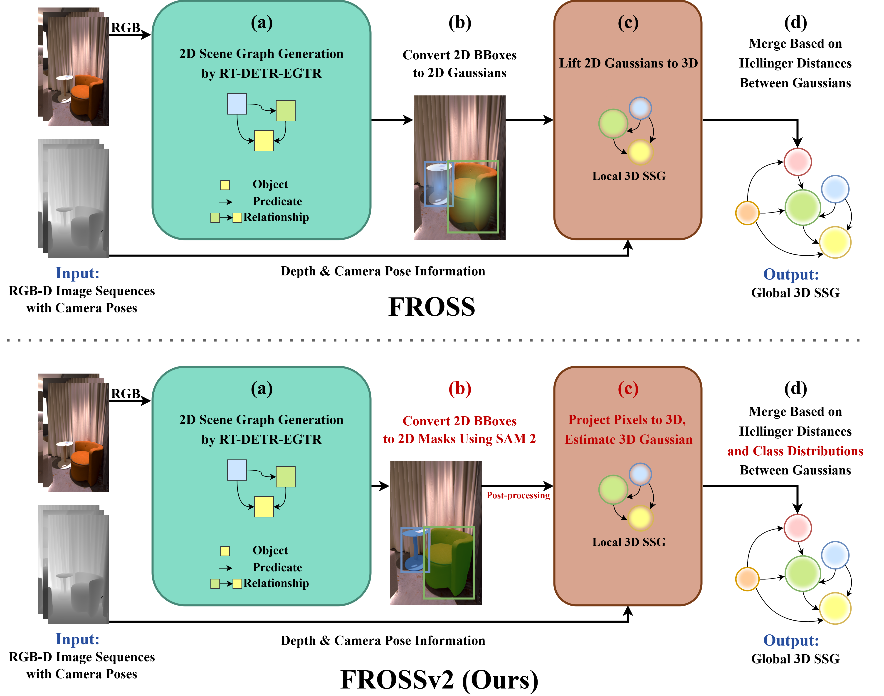

<div align="center">
    
# FROSS: Faster-than-Real-Time Online 3D Semantic Scene Graph Generation from RGB-D Images <br> [ICCV 2025]

[](TODO)
[](TODO)
[](TODO)
[](TODO)
[](https://github.com/Howardkhh/ReplicaSSG)

</div>

<p align="center"></p>

## Abstract
<span style="color:#ff0000;">
    TODO: update abstract
</span>

> The ability to abstract complex 3D environments into simplified and structured representations is crucial across various domains. 3D semantic scene graphs (SSGs) achieve this by representing objects as nodes and their interrelationships as edges, facilitating high-level scene understanding. Existing methods for 3D SSG generation, however, face significant challenges, including high computational demands and non-incremental processing that hinder their suitability for real-time open-world applications. To address this issue, in this work, we propose FROSS (**F**aster-than-**R**eal-Time **O**nline 3D **S**emantic **S**cene Graph Generation), an innovative approach for online and faster-than-real-time 3D SSG generation method that leverages the direct lifting of 2D scene graphs to 3D space and represents objects as 3D Gaussian distributions. This framework eliminates the dependency on precise and computationally-intensive point cloud processing. Furthermore, we extend the Replica dataset with inter-object relationship annotations, creating the ReplicaSSG dataset for comprehensive evaluation of FROSS. The experimental results from evaluations on ReplicaSSG and 3DSSG datasets show that FROSS can achieve superior performance while being significantly faster than prior 3D SSG generation methods.

## Installation
```bash
# clone this repository
cd FROSS
pip install torch==2.3.0 torchvision==0.18.0 --index-url https://download.pytorch.org/whl/cu121
pip install -r requirements.txt
cd egtr/lib/fpn
sh make.sh
cd ../../..
```

## Prepare Dataset
#### 1. Download 3RScan Dataset
Agree to the terms of use and get the download script from [here](https://forms.gle/NvL5dvB4tSFrHfQH6) and save it as `3RScan.py`.
You may want to parallelize the download script for faster downloading speed.
```bash
python 3RScan.py -o Datasets/3RScan/data
wget "http://campar.in.tum.de/public_datasets/3RScan/3RScan.json" -P Datasets/3RScan/data
wget "http://campar.in.tum.de/public_datasets/3DSSG/3DSSG/objects.json" -P Datasets/3RScan/data
wget "http://campar.in.tum.de/public_datasets/3DSSG/3DSSG/relationships.json" -P Datasets/3RScan/data
```

#### 2. Extract and Preprocess 3RScan Dataset
```bash
git clone https://github.com/WaldJohannaU/3RScan.git
cd 3RScan/c++
```
Build the renderer following the instructions in the [3RScan repository](https://github.com/WaldJohannaU/3RScan/tree/master/c%2B%2B).
<details>

<summary>Encounter error when building rio_renderer?</summary>

If you encounter error similar to the below when building rio_renderer with `make` command:
```bash
[ 50%] Linking CXX executable rio_renderer
 /usr/bin/ld: CMakeFiles/rio_renderer.dir/src/renderer.cc.o: warning: relocation against `__glewGenVertexArrays' in read-only section `.text._ZN5Model11processMeshEP6aiMeshPK7aiScene[_ZN5Model11processMeshEP6aiMeshPK7aiScene]'
 /usr/bin/ld: CMakeFiles/rio_renderer.dir/src/renderer.cc.o: in function `RIO::Renderer::ReadRGB(cv::Mat&)':                        renderer.cc:(.text+0x1ed0): undefined reference to `__glewBindFramebuffer'
 /usr/bin/ld: CMakeFiles/rio_renderer.dir/src/renderer.cc.o: in function `RIO::Renderer::Render(Model&, Shader&)':                  renderer.cc:(.text+0x2d95): undefined reference to `__glewUseProgram'
 /usr/bin/ld: renderer.cc:(.text+0x2ddf): undefined reference to `__glewUniformMatrix4fv'
 usr/bin/ld: renderer.cc:(.text+0x2ed8): undefined reference to `__glewGetUniformLocation'
 usr/bin/ld: renderer.cc:(.text+0x3016): undefined reference to `__glewUniform1i'
 usr/bin/ld: renderer.cc:(.text+0x3042): undefined reference to `__glewGetUniformLocation'
 usr/bin/ld: renderer.cc:(.text+0x322e): undefined reference to `__glewActiveTexture'
 usr/bin/ld: renderer.cc:(.text+0x35aa): undefined reference to `__glewBindVertexArray'
 usr/bin/ld: renderer.cc:(.text+0x35cf): undefined reference to `__glewBindVertexArray'
 usr/bin/ld: renderer.cc:(.text+0x35ea): undefined reference to `__glewActiveTexture'
```
Try patching the `CMakeLists.txt` file with the following:
```bash
cd ../../.. # back to 3RScan directory
git apply ../scripts/files/rio_renderer.patch
cd c++/rio_renderer/build
make # and try to make again
```
</details>

<br/>
Render depth maps from the 3RScan dataset using the renderer.

You may need a vnc server to run the renderer in a headless environment.

```bash
python3 scripts/dataset/extract_and_preprocess_3RScan.py --path ./Datasets/3RScan/ --rio_renderer_path ./3RScan/c++/rio_renderer/build/
```


#### 3. Prepare Datasets for Object Detection, 2D Scene Graph Generation, and 3D Scene Graph Generation
```bash
    cd scripts
    bash prepare_datasets.sh
    cd ../..
```

#### 4. Download ReplicaSSG Dataset
Download and process the ReplicaSSG dataset according to the [instructions](https://github.com/Howardkhh/ReplicaSSG).
And extract 2D scene graphs from the ReplicaSSG dataset.
```bash
python scripts/dataset/boxes2coco.py --path ./Datasets/Replica --label_categories replica
```

#### (Optional) 5. Download Visual Genome Dataset
If you want to train RT-DETR-EGTR on the visual genome dataset, please download the visual genome dataset according to this [instruction](https://github.com/yrcong/RelTR/blob/main/data/README.md).

## Download Pretrained RT-DETR-EGTR Weights
You can download the pretrained RT-DETR-EGTR weights from the following links:
- [3RScan](https://drive.google.com/file/d/1k7PLsY0CqbZbBHeKU8yA2Eof8wFh4Hap/view?usp=sharing)
- [ReplicaSSG](https://drive.google.com/file/d/1glMkDC1UPQbd8JfjQa6VzNQRwMDAnOsI/view?usp=sharing)

Extract and put them into the `weights/RT-DETR-EGTR` directory. You may skip the next two steps if you have downloaded the pretrained weights.

## Pretraining RT-DETR on 3RScan and ReplicaSSG
#### 1. Download Pretrained RT-DETR Weights
```bash
mkdir -p weights/RT-DETR
wget https://github.com/lyuwenyu/storage/releases/download/v0.1/rtdetrv2_r50vd_m_7x_coco_ema.pth -P weights/RT-DETR/
```

#### 2. Train RT-DETR
```bash
# 3RScan dataset
export NUM_PROC=4 # number of GPUs
OMP_NUM_THREADS=4 torchrun --log_dir logs/RT-DETR -r 3 -t 3 --master_port=9909 --nproc_per_node=$NUM_PROC RT-DETR/rtdetrv2_pytorch/tools/train.py -c RT-DETR/rtdetrv2_pytorch/configs/rtdetrv2/rtdetrv2_r50vd_m_7x_3rscan20.yml -t weights/RT-DETR/rtdetrv2_r50vd_m_7x_coco_ema.pth --output-dir weights/RT-DETR/3RScan20 --use-amp --seed=0

# ReplicaSSG dataset
OMP_NUM_THREADS=4 torchrun --log_dir logs/RT-DETR -r 3 -t 3 --master_port=9909 --nproc_per_node=$NUM_PROC RT-DETR/rtdetrv2_pytorch/tools/train.py -c RT-DETR/rtdetrv2_pytorch/configs/rtdetrv2/rtdetrv2_r50vd_m_7x_vg.yml -t weights/RT-DETR/rtdetrv2_r50vd_m_7x_coco_ema.pth --output-dir weights/RT-DETR/VG --use-amp --seed=0
```

#### 3. Evaluate RT-DETR
```bash
# 3RScan dataset
OMP_NUM_THREADS=4 torchrun --master_port=9909 --nproc_per_node=4 RT-DETR/rtdetrv2_pytorch/tools/train.py -c RT-DETR/rtdetrv2_pytorch/configs/rtdetrv2/rtdetrv2_r50vd_m_7x_3rscan20.yml -r weights/RT-DETR/3RScan20/last.pth --test-only

# ReplicaSSG dataset
OMP_NUM_THREADS=4 torchrun --master_port=9909 --nproc_per_node=4 RT-DETR/rtdetrv2_pytorch/tools/train.py -c RT-DETR/rtdetrv2_pytorch/configs/rtdetrv2/rtdetrv2_r50vd_m_7x_vg.yml -r weights/RT-DETR/VG/last.pth --test-only
```

## Train RT-DETR-EGTR on 3RScan and ReplicaSSG
#### 1. Train RT-DETR-EGTR
```bash
# 3RScan dataset
python egtr/train_rtdetr_egtr.py --data_path Datasets/3RScan/2DSG20 --output_path weights/RT-DETR-EGTR/3RScan20 --pretrained weights/RT-DETR/3RScan20/last.pth --gpus $NUM_PROC

# ReplicaSSG dataset
python egtr/train_rtdetr_egtr.py --data_path Datasets/visual_genome/ --output_path weights/RT-DETR-EGTR/VG --pretrained weights/RT-DETR/VG/last.pth --gpus $NUM_PROC --lr_initialized 2e-5
```

#### 2. Export Model to ONNX and TensorRT
Please change the artifact path to the path of the trained model.
```bash
# 3RScan dataset
PYTHON_PATH=. python scripts/tools/export_onnx_trt.py --artifact_path weights/RT-DETR-EGTR/3RScan20/egtr__RT-DETR__3RScan20__last.pth/batch__24__epochs__50_25__lr__2e-07_2e-06_0.0002__finetune/version_0

# ReplicaSSG dataset
PYTHON_PATH=. python scripts/tools/export_onnx_trt.py --artifact_path weights/RT-DETR-EGTR/VG/egtr__RT-DETR__3RScan20__last.pth/batch__24__epochs__50_25__lr__2e-07_2e-06_0.0002__finetune/version_0
```

#### 3. Evaluate RT-DETR-EGTR
```bash
# 3RScan dataset
python egtr/evaluate_rtdetr_egtr.py --data_path Datasets/3RScan/2DSG20 --artifact_path weights/RT-DETR-EGTR/3RScan20/egtr__RT-DETR__3RScan20__last.pth/batch__24__epochs__50_25__lr__2e-07_2e-06_0.0002__finetune/version_0

# ReplicaSSG dataset
python egtr/evaluate_rtdetr_egtr.py --data_path Datasets/visual_genome/ --artifact_path weights/RT-DETR-EGTR/VG/egtr__RT-DETR__3RScan20__last.pth/batch__24__epochs__50_25__lr__2e-07_2e-06_0.0002__finetune/version_0
```

## Estimate Camera Trajectory for ReplicaSSG Using ORB-SLAM3 (Optional)
#### 1. Build ORB-SLAM3 following the [instructions](https://github.com/UZ-SLAMLab/ORB_SLAM3).

#### 2. Generate association file for ReplicaSSG
```bash
cd scripts/dataset
python generate_association_file.py --replica_path ../../Datasets/Replica
```

#### 3. Run ORB-SLAM3 on ReplicaSSG
```bash
# Example bash script to run ORB-SLAM3 on all scenes in ReplicaSSG
cd <orbslam_path> # ~/ORB_SLAM3
set -euxo pipefail
scenes=("office_4" "room_0" "room_1" "room_2" "hotel_0" "frl_apartment_0" "frl_apartment_1" "frl_apartment_2" "frl_apartment_3" "frl_apartment_4" "frl_apartment_5" "apartment_0" "apartment_1" "apartment_2" "office_0" "office_1" "office_2" "office_3")
replica_path=<replica_path> # path to the Replica dataset (~/FROSS/Datasets/Replica)

# activate Python2 virtual environment with Numpy
# source .py2_venv/bin/activate

for scene in "${scenes[@]}"
do
    ./Examples/RGB-D/rgbd_tum  Vocabulary/ORBvoc.txt ${replica_path}/ReplicaSSG/files/ORBSLAM3_parameters.yaml ${replica_path}/data/${scene} ${replica_path}/data/${scene}/association.txt
    mv CameraTrajectory.txt CameraTrajectory_${scene}.txt
    mv KeyFrameTrajectory.txt KeyFrameTrajectory_${scene}.txt

    python2 evaluation/evaluate_ate_scale.py ${replica_path}/data/${scene}/trajectory_gt.txt CameraTrajectory_${scene}.txt --plot ${scene}.pdf --verbose --verbose2 > ATE_scale_${scene}.txt
done
```

#### 4. Convert SLAM Trajectory to 3RScan Format
```bash
cd scripts/dataset
python convert_SLAM_trajectory_all.sh ../../Datasets/Replica <orbslam_path>
```

## RUN FROSS
```bash
cd Merging
# 3RScan dataset
python main.py --artifact_path ../weights/RT-DETR-EGTR/3RScan20/egtr__RT-DETR__3RScan20__last.pth/batch__6__epochs__50_25__lr__2e-07_2e-06_0.0002__finetune/version_0 --dataset_path ../Datasets/3RScan
# With ground truth 2D scene graph
python main.py --dataset_path ../Datasets/3RScan --use_gt_sg
# With SLAM trajectory
python main.py --dataset_path ../Datasets/3RScan --not_use_gt_pose

# ReplicaSSG dataset
python main.py --artifact_path ../weights/RT-DETR-EGTR/VG/egtr__RT-DETR__VG__last.pth/batch__6__epochs__50_25__lr__2e-07_2e-06_2e-05__finetune/version_0/ --dataset_path ../Datasets/Replica
# With ground truth 2D scene graph
python main.py --dataset_path ../Datasets/Replica --label_categories replica --use_gt_sg
# With SLAM trajectory
python main.py --dataset_path ../Datasets/Replica --label_categories replica --not_use_gt_pose
```

## Evaluate FROSS
```bash
# 3RScan dataset
python evaluate.py --dataset_path ../Datasets/3RScan/ --prediction_path output/scannet/predictions_gaussian_obj0.7_rel10_hell0.85_kfnone_test_gtpose.pkl
# With ground truth 2D scene graph
python evaluate.py --dataset_path ../Datasets/Replica/ --prediction_path output/scannet/predictions_gaussian_obj0.7_rel10_hell0.85_kfnone_test_gt2dsg_gtpose.pkl
# With SLAM trajectory
python evaluate.py --dataset_path ../Datasets/Replica/ --prediction_path output/scannet/predictions_gaussian_obj0.7_rel10_hell0.85_kfnone_test.pkl

# ReplicaSSG dataset
python evaluate.py --dataset_path ../Datasets/Replica/ --label_categories replica --prediction_path output/replica/predictions_gaussian_obj0.7_rel10_hell0.85_kfnone_test_gtpose.pkl
# With ground truth 2D scene graph
python evaluate.py --dataset_path ../Datasets/Replica/ --label_categories replica --prediction_path output/replica/predictions_gaussian_obj0.7_rel10_hell0.85_kfnone_test_gt2dsg_gtpose.pkl
# With SLAM trajectory
python evaluate.py --dataset_path ../Datasets/Replica/ --label_categories replica --prediction_path output/replica/predictions_gaussian_obj0.7_rel10_hell0.85_kfnone_test.pkl
```

## Citation

```
@InProceedings{hou2025fross,
    author    = {Hao-Yu Hou, Chun-Yi Lee, Motoharu Sonogashira, and Yasutomo Kawanishi},
    title     = {{FROSS}: {F}aster-than-{R}eal-{T}ime {O}nline 3{D} {S}emantic {S}cene {G}raph {G}eneration from {RGB-D} {I}mages},
    booktitle = {Proceedings of the IEEE/CVF International Conference on Computer Vision (ICCV)},
    month     = {October},
    year      = {2025}
}
```