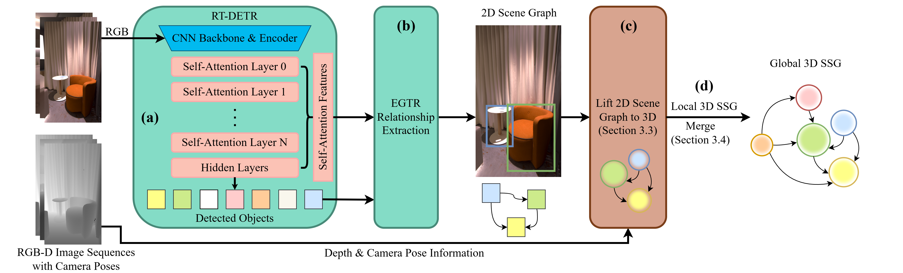

<div align="center">
    
# FROSSv2: Improving Real-Time 3D Semantic Scene Graph Generation Model

</div>

<p align="center"></p>

Congratulations! You have found the hidden version 2 of FROSS! This was a course project completed with Jocelyn Huang and Darren Jian at the University of Toronto. In this version, we improved the original 3D Gaussian approximation by incorporating the SAM 2 model and updated the merging algorithm to also consider object class distributions. Although we refer to it as version 2, there is still a lot of room for improvement and we are not yet ready for an official release. I may revisit and refine this project in the future if I have some free time. (probabily not :) )

## Table of Contents
- [Installation](#installation)
- [Prepare Dataset](#prepare-dataset)
  - [Download 3RScan dataset](#1-download-3rscan-dataset)
  - [Extract and preprocess 3RScan dataset](#2-extract-and-preprocess-3rscan-dataset)
  - [Prepare datasets for object detection, 2D scene graph generation, and 3D scene graph generation](#3-prepare-datasets-for-object-detection-2d-scene-graph-generation-and-3d-scene-graph-generation)
  - [Download ReplicaSSG dataset](#4-download-replicassg-dataset)
- [Download Pretrained RT-DETR-EGTR Weights](#download-pretrained-rt-detr-egtr-weights)
- [Run FROSS](#run-fross)
- [Evaluate FROSS](#evaluate-fross)
- [Visualize Output](#visualize-output)
- [References](#references)

## Installation
Tested with Python 3.10 and CUDA 11.8 on Ubuntu 22.04.4.
### Prerequisites
- libvips-dev

### Install Dependencies
```bash
git clone https://github.com/Howardkhh/FROSS.git
cd FROSS
pip install -r requirements.txt
pip install -e sam2
pip install -U numpy==1.23.5 # It is ok if the output shows dependency conflicts
cd EGTR/lib/fpn
sh make.sh
cd ../../..
```

## Prepare Dataset
#### 1. Download 3RScan dataset
Agree to the terms of use and get the download script from [here](https://forms.gle/NvL5dvB4tSFrHfQH6) and save it as `3RScan.py`.
You may want to parallelize the script for faster download speed.
```bash
python 3RScan.py -o Datasets/3RScan/data
wget "http://campar.in.tum.de/public_datasets/3RScan/3RScan.json" -P Datasets/3RScan/data
wget "http://campar.in.tum.de/public_datasets/3DSSG/3DSSG/objects.json" -P Datasets/3RScan/data
wget "http://campar.in.tum.de/public_datasets/3DSSG/3DSSG/relationships.json" -P Datasets/3RScan/data
```

#### 2. Extract and preprocess 3RScan dataset
```bash
git clone https://github.com/WaldJohannaU/3RScan.git
cd 3RScan/c++
```
Build the rio_renderer (not rio_example) following the instructions in the [3RScan repository](https://github.com/WaldJohannaU/3RScan/tree/master/c%2B%2B).
<details>

<summary>Encounter error when building rio_renderer?</summary>

If you encounter error similar to the below when building rio_renderer with `make` command:
```bash
[ 50%] Linking CXX executable rio_renderer
 /usr/bin/ld: CMakeFiles/rio_renderer.dir/src/renderer.cc.o: warning: relocation against `__glewGenVertexArrays' in read-only section `.text._ZN5Model11processMeshEP6aiMeshPK7aiScene[_ZN5Model11processMeshEP6aiMeshPK7aiScene]'
 /usr/bin/ld: CMakeFiles/rio_renderer.dir/src/renderer.cc.o: in function `RIO::Renderer::ReadRGB(cv::Mat&)':                        renderer.cc:(.text+0x1ed0): undefined reference to `__glewBindFramebuffer'
 /usr/bin/ld: CMakeFiles/rio_renderer.dir/src/renderer.cc.o: in function `RIO::Renderer::Render(Model&, Shader&)':                  renderer.cc:(.text+0x2d95): undefined reference to `__glewUseProgram'
 /usr/bin/ld: renderer.cc:(.text+0x2ddf): undefined reference to `__glewUniformMatrix4fv'
 usr/bin/ld: renderer.cc:(.text+0x2ed8): undefined reference to `__glewGetUniformLocation'
 usr/bin/ld: renderer.cc:(.text+0x3016): undefined reference to `__glewUniform1i'
 usr/bin/ld: renderer.cc:(.text+0x3042): undefined reference to `__glewGetUniformLocation'
 usr/bin/ld: renderer.cc:(.text+0x322e): undefined reference to `__glewActiveTexture'
 usr/bin/ld: renderer.cc:(.text+0x35aa): undefined reference to `__glewBindVertexArray'
 usr/bin/ld: renderer.cc:(.text+0x35cf): undefined reference to `__glewBindVertexArray'
 usr/bin/ld: renderer.cc:(.text+0x35ea): undefined reference to `__glewActiveTexture'
```
Try patching the `CMakeLists.txt` file with the following:
```bash
cd ../../.. # back to 3RScan directory
git apply ../Scripts/files/rio_renderer.patch
cd c++/rio_renderer/build
make # and try to make again
```
</details>

<br/>
Render depth maps from the 3RScan dataset using the renderer.

You may need a vnc server to run the renderer in a headless environment.
(For example: `vncserver && export DISPLAY=:1.0`)

```bash
cd ../../../.. # back to FROSS directory
python3 Scripts/dataset/extract_and_preprocess_3RScan.py --path ./Datasets/3RScan/ --rio_renderer_path ./3RScan/c++/rio_renderer/build/
```

Check data integrity.
```bash
python Scripts/dataset/check.py --path Datasets/3RScan
```
The output should look like below.
```bash
Number of folders: 1482
Number of folders with sequence folder: 1482
Number of folders with all images: 1482
Number of images: 363555
Number of images with bounding box files: 363555
Number of rendered color images: 363555
Number of rendered depth images: 363555
Number of rendered label images: 363555
Number of visibility files: 363555
Number of instance files: 363555
```

#### 3. Prepare datasets for object detection, 2D scene graph generation, and 3D scene graph generation
```bash
cd Scripts
bash prepare_datasets.sh
cd ..
```

#### 4. Download ReplicaSSG dataset
Download and process the ReplicaSSG dataset according to the [instructions](https://github.com/Howardkhh/ReplicaSSG).

Move the dataset folder to `./Datasets`
```bash
# For example
mv ~/ReplicaSSG/Replica ./Datasets
```

And extract 2D scene graphs from the ReplicaSSG dataset.
```bash
python Scripts/dataset/boxes2coco.py --path ./Datasets/Replica --label_categories replica
```

## Download Pretrained RT-DETR-EGTR Weights
You can download the pretrained RT-DETR-EGTR weights from the following links:
- [3RScan](https://drive.google.com/file/d/1k7PLsY0CqbZbBHeKU8yA2Eof8wFh4Hap/view?usp=sharing)
- [ReplicaSSG](https://drive.google.com/file/d/1glMkDC1UPQbd8JfjQa6VzNQRwMDAnOsI/view?usp=sharing)

Extract and put them into the `weights/RT-DETR-EGTR` directory. You may skip the next two steps if you have downloaded the pretrained weights.
```bash
mkdir -p weights/RT-DETR-EGTR
cd weights/RT-DETR-EGTR
# Put the downloaded weight zip files here
unzip 3RScan20.zip
unzip VG.zip
cd ../..
```

Export the model to ONNX and TensorRT format:
```bash
# 3RScan dataset
PYTHONPATH=. python Scripts/tools/export_onnx_trt.py --artifact_path weights/RT-DETR-EGTR/3RScan20/egtr__RT-DETR__3RScan20__last.pth/batch__6__epochs__50_25__lr__2e-07_2e-06_0.0002__finetune/version_0

# ReplicaSSG dataset
PYTHONPATH=. python Scripts/tools/export_onnx_trt.py --artifact_path weights/RT-DETR-EGTR/VG/egtr__RT-DETR__VG__last.pth/batch__6__epochs__50_25__lr__2e-07_2e-06_2e-05__finetune/version_0
```

## RUN FROSS
<details>
<summary><code>main.py</code> parameters</summary>

- `--use_gt_sg`: Use the ground truth 2D scene graph instead of RT-DETR-EGTR prediction.
- `--not_use_gt_pose`: Use SLAM trajectory instead of ground truth camera pose.
- `--not_preload`: Do not preload all images into memory prior to running each scene. Set this if you run out of RAM. Disable this if you are measuring runtime performance.
- `--use_sam2`: Use SAM 2 model for generating object segmentation masks for estimating 3D Gaussians.
- `--sam2_postprocessing`: Post-process the SAM 2 masks for better performance.
- `--classes_dist_method`: Method to compute class distribution distance. Use `top_class` for only considering the top predicted class as in the original FROSS. Use `dot_product` for version 2.
</details>

```bash
cd Merging
# 3RScan dataset
python main.py --artifact_path ../weights/RT-DETR-EGTR/3RScan20/egtr__RT-DETR__3RScan20__last.pth/batch__6__epochs__50_25__lr__2e-07_2e-06_0.0002__finetune/version_0/ --dataset_path ../Datasets/3RScan

# ReplicaSSG dataset
python main.py --artifact_path ../weights/RT-DETR-EGTR/VG/egtr__RT-DETR__VG__last.pth/batch__6__epochs__50_25__lr__2e-07_2e-06_2e-05__finetune/version_0/ --dataset_path ../Datasets/Replica --label_categories replica
```

## Evaluate FROSS
```bash
# 3RScan dataset
python evaluate.py --dataset_path ../Datasets/3RScan/ --prediction_path output/scannet/predictions_gaussian_obj0.7_rel10_merging0.7_classdist_dot_product0.3_kfnone_test_gtpose_sam2_postprocessing.pkl
# ReplicaSSG dataset
python evaluate.py --dataset_path ../Datasets/Replica/ --label_categories replica --prediction_path output/replica/predictions_gaussian_obj0.7_rel10_merging0.7_classdist_dot_product0.3_kfnone_test_gtpose_sam2_postprocessing.pkl
```

## Visualize Output
To generate visualization videos (using ReplicaSSG as an example):

1\. Specify `--visualize_folder` in `main.py`.
```bash
python main.py --artifact_path ../weights/RT-DETR-EGTR/VG/egtr__RT-DETR__VG__last.pth/batch__6__epochs__50_25__lr__2e-07_2e-06_2e-05__finetune/version_0/ --dataset_path ../Datasets/Replica --label_categories replica --visualize_folder <visualization_output_folder>
```

2\. Use the `render.sh` script in `Visualization` folder to visualize the output.
```bash
cd Visualization
bash render.sh ../../Datasets/Replica/data ../<visualization_output_folder>
```

## References
- [RT-DETR](https://github.com/lyuwenyu/RT-DETR)
- [EGTR](https://github.com/naver-ai/egtr)
- [3RScan](https://github.com/WaldJohannaU/3RScan)
- [3DSSG](https://3dssg.github.io/)
- [Replica](https://github.com/facebookresearch/Replica-Dataset)
- [3D Semantic Scene Graph Estimations, Wu et al.](https://github.com/ShunChengWu/3DSSG)
- [3-D Scene Graph, Kim et al.](https://github.com/Uehwan/3-D-Scene-Graph)
- [Segment Anything Model 2 (SAM 2)](https://github.com/facebookresearch/sam2)